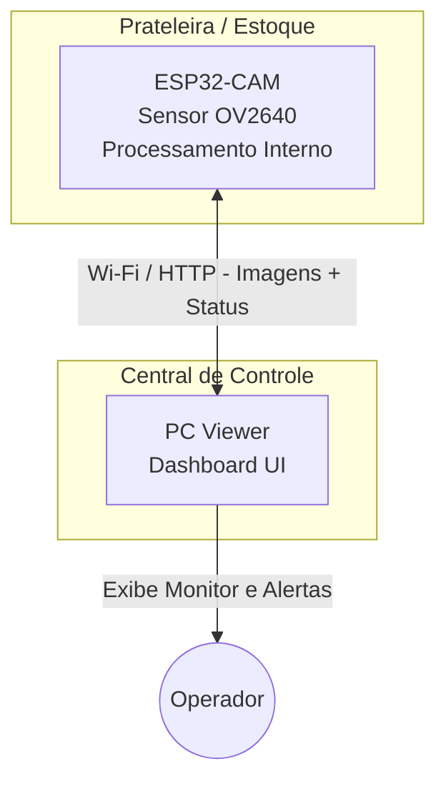
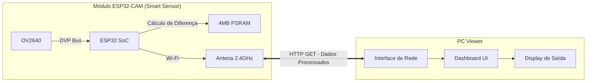
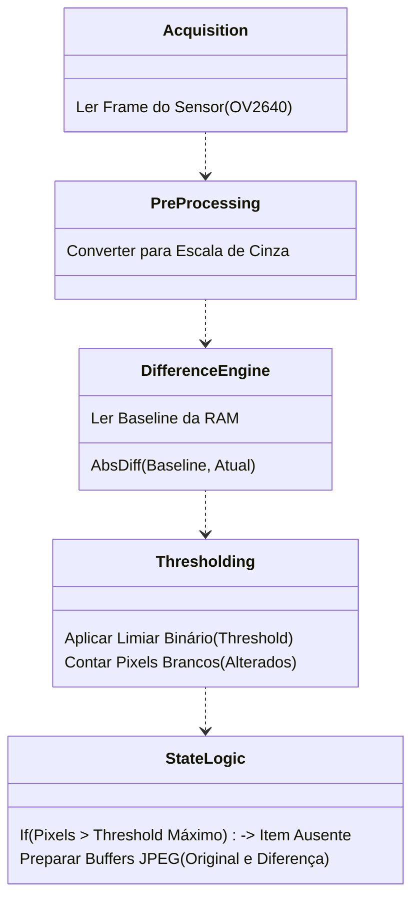
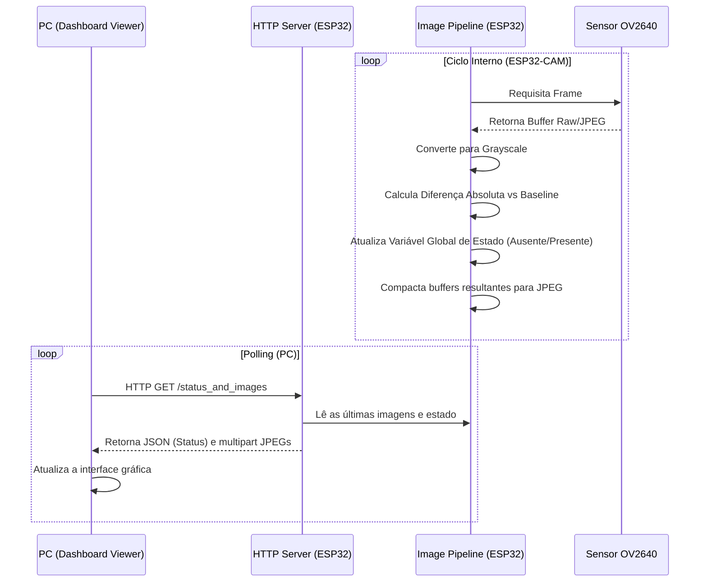

# System Architecture

| Metadado            | Detalhe                                                |
| :------------------ | :----------------------------------------------------- |
| **Projeto**         | Sistema de Controle de Estoque com Visão Computacional |
| **ID do Documento** | SCEVC-DOC-002                                          |
| **Versão**          | 0.1                                                    |
| **Status**          | Rascunho                                                 |
| **Data**            | 05/05/2026                                             |
| **Hardware**        | ESP32-CAM + PC                                         |
| **Stack:**          | C/C++ (ESP32 para Processamento) + UI Viewer no PC     |

---

## 1. Visão Geral (C4 Context Diagram)

O diagrama abaixo ilustra o contexto de alto nível do sistema e suas interações com a inteligência na borda (Edge Computing).

## 2. Arquitetura de Hardware

- **Dispositivo de Captura e Borda**: Módulo ESP32-CAM equipado com câmera OV2640. Toda a lógica de visão computacional ocorre aqui, aproveitando os 4MB de PSRAM para alocação do frame original e dos *buffers* de diferença.
- **Processamento Central (Dashboard)**: PC Genérico atuando puramente como cliente HTTP para buscar o estado ("Item Ausente"/"Presente") e as imagens resultantes para visualização humana.
- **Rede**: Ponto de Acesso Wi-Fi local para comunicação TCP/IP na porta 80.

## 3. Arquitetura de Software

Toda a carga de processamento das imagens e tomada de decisão é atribuída ao firmware do ESP32-CAM. O PC atua apenas como cliente de apresentação.

### 3.1 Pipeline de Visão Computacional (ESP32-CAM Firmware)

A lógica interna executada no ESP32-CAM a cada ciclo (Frame):

## 4. Fluxo de Dados (Sequence Diagram)

### 4.1 Ciclo de Processamento e Visualização

Este fluxo detalha como o ESP32 realiza o trabalho de visão e como o PC consulta os resultados.

## 5. Próximos Passos (Expansão Futura)

Para evoluir a arquitetura, o sistema pode incorporar:

- Redes Neurais Leves (TinyML) rodando diretamente no ESP32-S3 para substituir a subtração de fundo tradicional.
- Definição de Múltiplas ROIs (Regions of Interest) na mesma imagem processadas no ESP32.
- O ESP32 pode parar de depender de *polling* do PC e passar a publicar ativamente mudanças via MQTT.
